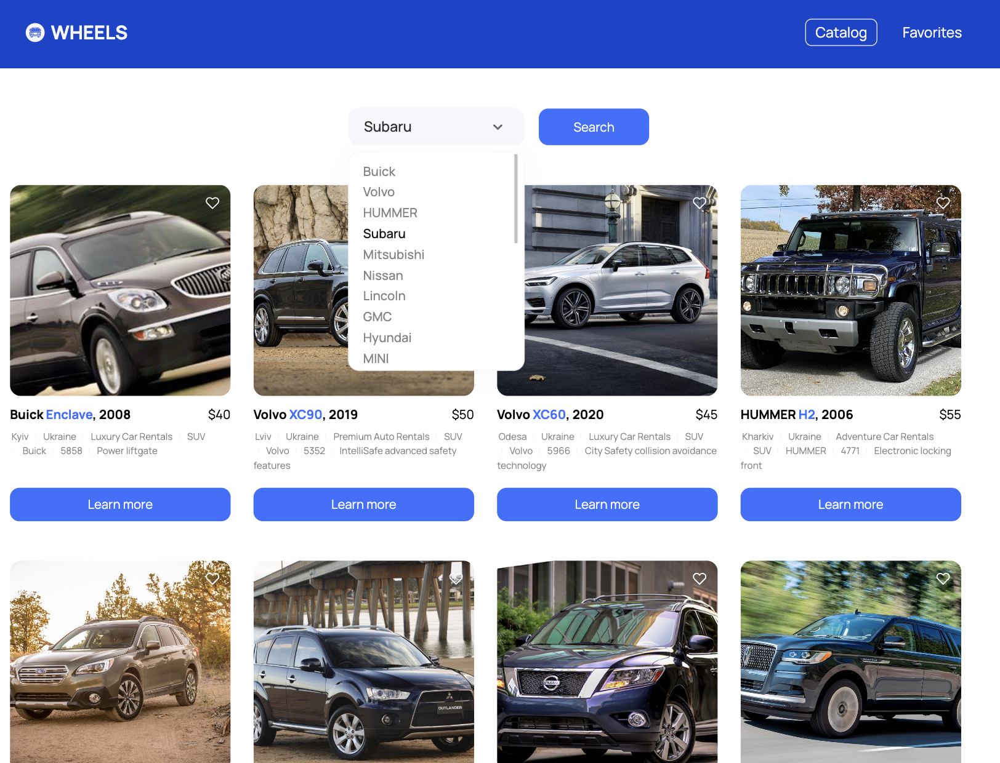

# wheels-car-rental

A web-application for a car rental company, where user can check info about the
available cars and contact the rental service.

Supports resolutions from 390px. Uses mockAPI service.

Libraries and utils:

- [react](https://react.dev/)
- [react-modal](https://www.npmjs.com/package/react-modal)
- [react-hot-toast](https://react-hot-toast.com/)
- [react-responsive](https://www.npmjs.com/package/react-responsive)
- [react-select](https://www.npmjs.com/package/react-select)
- [react-hook-form](https://www.npmjs.com/package/react-hook-form)
- [react-spinners](https://www.npmjs.com/package/react-spinners)
- [swiper](https://www.npmjs.com/package/swiper)
- [react-redux](https://www.npmjs.com/package/react-redux)
- [@reduxjs/toolkit](https://www.npmjs.com/package/@reduxjs/toolkit)
- [axios](https://www.npmjs.com/package/axios)
- and some more

Production: https://main--relaxed-donut-dd6a9d.netlify.app/catalog
